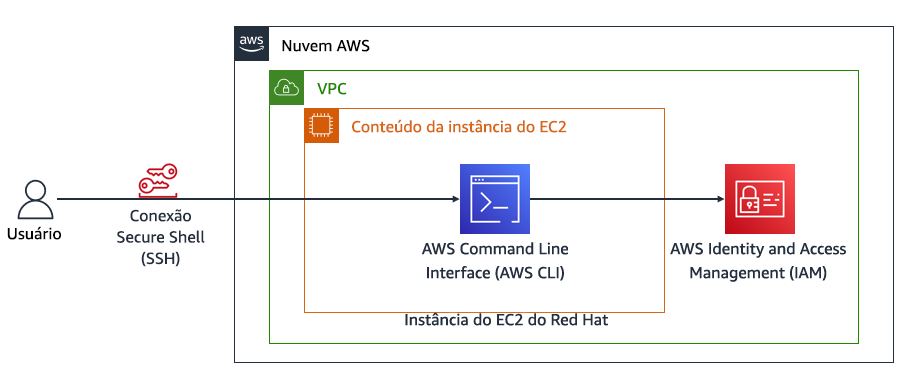
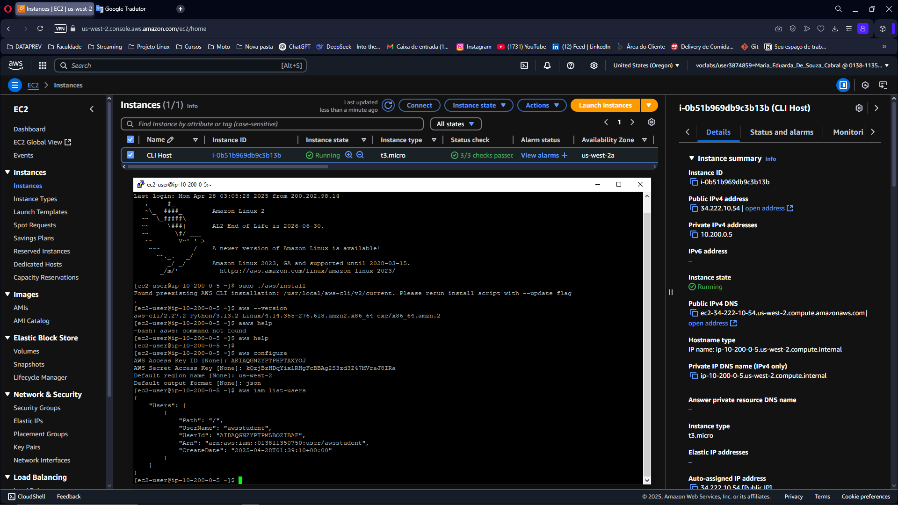

# Instalação e Configuração da AWS CLI

## Diagrama de Arquitetura AWS

  
*Figura 1: Arquitetura do ambiente EC2 mostrando:*

- **VPC**: Ambiente de rede isolado na Nuvem AWS onde a instância EC2 está provisionada.
- **Instância EC2 (Red Hat)**: Máquina virtual que hospeda o conteúdo e a AWS CLI.
- **AWS CLI**: Ferramenta de linha de comando para gerenciar recursos da AWS.
- **IAM**: Serviço de Gerenciamento de Identidade e Acesso da AWS.
- **Conexão SSH**: Método utilizado para acesso remoto seguro à instância EC2.

---

## Tarefa 1: Conectar-se à Instância EC2 via SSH

### **Windows**
1. Baixar o arquivo de credenciais `labsuser.ppk`.
2. Usar o **PuTTY** para conectar ao **IP público** da instância.
3. Configurar a sessão conforme a [documentação oficial da AWS](https://docs.aws.amazon.com/AWSEC2/latest/UserGuide/putty.html).

### **macOS/Linux**
1. Baixar o arquivo de credenciais `labsuser.pem`.
2. Ajustar permissões do arquivo:
   ```bash
   chmod 400 labsuser.pem
   ```
3. Conectar via terminal:
   ```bash
   ssh -i labsuser.pem ec2-user@<ip-address>
   ```

---

## Tarefa 2: Instalar a AWS CLI

1. Baixar o instalador:
   ```bash
   curl "https://awscli.amazonaws.com/awscli-exe-linux-x86_64.zip" -o "awscliv2.zip"
   ```
2. Descompactar e instalar:
   ```bash
   unzip -u awscliv2.zip
   sudo ./aws/install
   ```
3. Confirmar a instalação:
   ```bash
   aws --version
   ```

---

## Tarefa 3: Verificar Configurações do IAM no Console AWS

1. Acessar o serviço **IAM** no console da AWS.
2. Inspecionar:
   - A política `lab_policy` (em formato JSON).
   - As credenciais do usuário `awsstudent` (Access Key ID e Secret Access Key).

---

## Tarefa 4: Configurar a AWS CLI

Configurar a CLI com o comando:
```bash
aws configure
```
Inserir as informações solicitadas:
- **Access Key ID**: Obtida no console.
- **Secret Access Key**: Obtida no console.
- **Região padrão**: `us-west-2`.
- **Formato de saída**: `json`.

---

## Tarefa 5: Usar a AWS CLI para Gerenciar IAM

1. Listar os usuários:
   ```bash
   aws iam list-users
   ```
2. **Desafio**: Baixar a política `lab_policy` em formato JSON:
   ```bash
   aws iam get-policy-version --policy-arn <ARN-da-política> --version-id v1 > lab_policy.json
   ```

---

## Conclusão

Após concluir todas as tarefas, você terá:
- Estabelecido a conexão SSH com a instância EC2.
- Instalado e validado a AWS CLI.
- Configurado corretamente o acesso usando as credenciais do IAM.
- Executado comandos para listar usuários e baixar políticas de segurança, reforçando o uso prático da AWS CLI no gerenciamento de recursos.

  
*Figura 2:*

---

