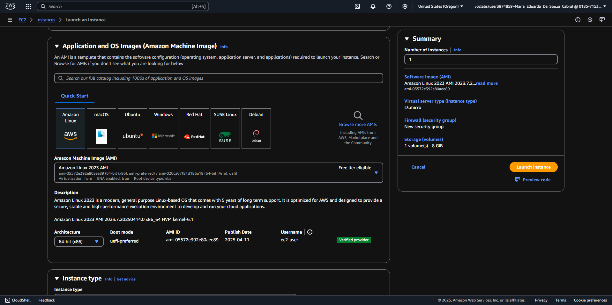
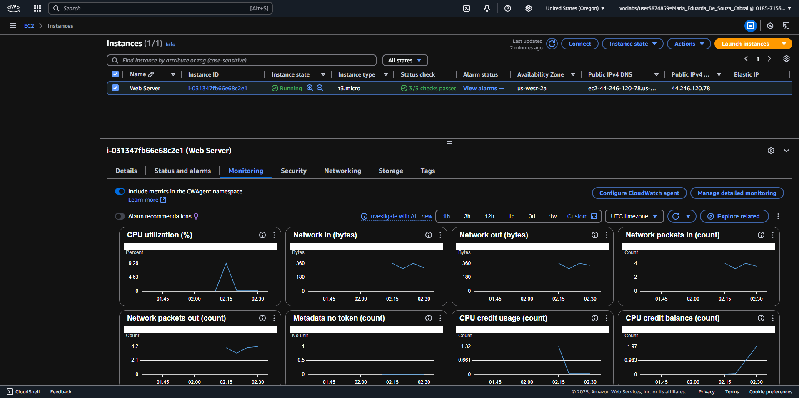
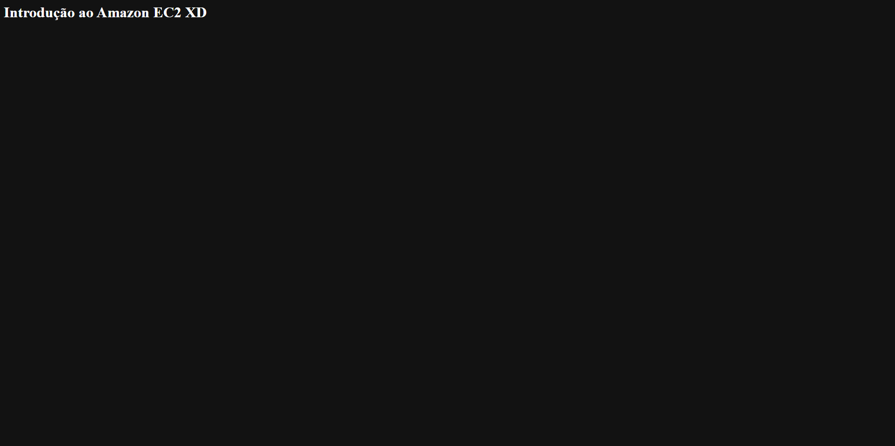

# Introdução ao Amazon EC2

## Diagrama de Arquitetura AWS

  
*Figura 1: Arquitetura do ambiente EC2 mostrando:*
- **Availability Zone**: Onde a instância está hospedada.
- **Security Group**: Atuando como firewall virtual.
- **IIS Web Server**: Serviço em execução na instância EC2.

---

## Tarefa 1: Executar uma instância EC2 com servidor web

### Passos:
1. Acessar o console EC2 > "Launch instance".
2. Selecionar a AMI: **Amazon Linux 2**.
3. Escolher o tipo de instância: `t3.micro` (1 vCPU, 1 GiB RAM).
4. Configurar:
   - Rede: **Lab VPC**.
   - Ativar **proteção contra encerramento**.
   - Adicionar o script de dados do usuário:
     ```bash
     #!/bin/bash
     yum -y install httpd
     systemctl enable httpd
     systemctl start httpd
     echo '<html><h1>Texto de teste</h1></html>' > /var/www/html/index.html
     ```
5. Adicionar tag: `Name: Web Server`.
6. Configurar o grupo de segurança:
   - Nome: `Web Server security group`.
   - Remover a regra SSH e manter apenas HTTP (porta 80).
7. Iniciar sem par de chaves.

  
*Figura 2: Tela de criação da instância EC2 configurada com Amazon Linux 2 e Web Server.*

---

## Tarefa 2: Monitorar a instância

- Verificar status no console EC2:
  - **Estado**: `running`.
  - **Status checks**: `2/2 passed`.
- Monitorar métricas no **Amazon CloudWatch**:
  - **CPU utilization**: Consumo de CPU baixo (~9% em picos).
  - **Network in/out**: Tráfego de rede baixo (~360 bytes).
  - **Network packets in/out**: Cerca de 4 pacotes.
  - **CPU credit usage/balance**: Uso condizente com workloads leves (`t3.micro`).

- Capturar tela da instância:
  - `Actions > Monitor and troubleshoot > Get Instance Screenshot`.

**Observação**: A instância apresenta comportamento esperado para um ambiente de teste, sem sobrecarga de processamento ou rede.

  
*Figura 3: Monitoramento da instância EC2.*

---

## Tarefa 3: Acessar o servidor web

1. Copiar o **IPv4 público** da instância.
2. Tentar acessar via navegador (falhará inicialmente).
3. Atualizar o grupo de segurança:
   - Adicionar regra de entrada: `HTTP (porta 80)` com origem `Anywhere`.
4. Recarregar a página para ver a mensagem personalizada:  
   **"Introdução ao Amazon EC2 XD"**.

**Observação**:  
A exibição da página confirma que:
- O servidor web (Apache) está ativo na instância EC2.
- O acesso HTTP externo foi liberado corretamente no grupo de segurança.

---

## Tarefa 4: Redimensionar a instância

1. **Interromper** a instância antes de redimensionar.
2. Alterar o tipo de instância para `t3.small` (2x mais memória):
   - `Actions > Instance Settings > Change Instance Type`.
3. Aumentar o volume EBS de 8 GiB para 10 GiB:
   - Navegar até **Volumes** > `Modify Volume`.
4. Reiniciar a instância.

---

## Tarefa 5: Explorar limites do EC2

- Verificar os limites de recursos da região:
  - Número máximo de instâncias permitidas.
  - Solicitar aumento de limites, se necessário.

---

## Tarefa 6: Testar proteção contra encerramento

1. Tentar encerrar a instância (falhará devido à proteção contra encerramento).
2. Desativar a proteção:
   - `Actions > Instance Settings > Change Termination Protection`.
3. Encerrar a instância com sucesso.

---

## Conclusão

Após a execução dos passos, foi possível validar a criação e funcionamento do servidor web na instância EC2.  

- Instância EC2 criada corretamente:


- Acesso ao servidor web apresentando a página configurada:



---
