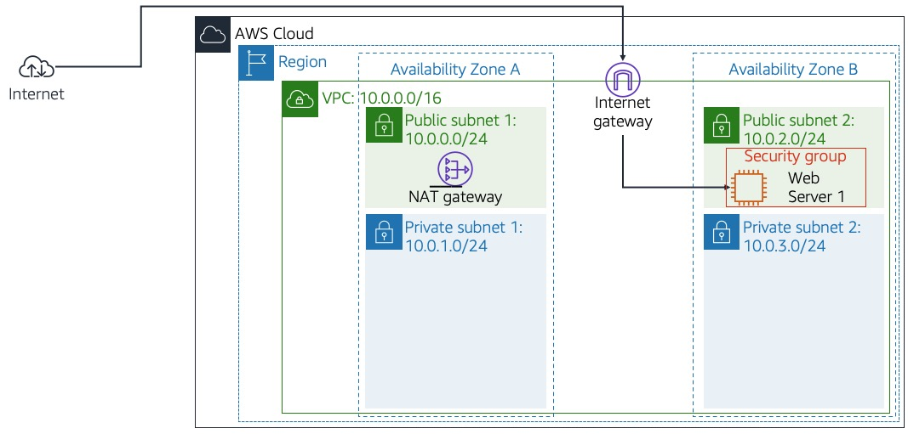

# 🌩️ AWS RDS Lab - Criar e Interagir com Banco de Dados

## 📊 Diagrama de Arquitetura AWS

  
*Figura 1: Estrutura inicial da infraestrutura.*

---

## 🔹 Estado Inicial

- **VPC** criada com o bloco de IP `10.0.0.0/16`.
- **Availability Zones**:
  - Zone A
  - Zone B

### Dentro das Availability Zones:

**Availability Zone A:**
- **Public Subnet 1** (`10.0.0.0/24`) — conectada à Internet.
- **Private Subnet 1** (`10.0.1.0/24`) — sem acesso direto à Internet.
- **NAT Gateway** na Public Subnet 1 para permitir conexões de saída da Private Subnet 1.

**Availability Zone B:**
- **Public Subnet 2** (`10.0.2.0/24`) — conectada à Internet.
  - Contém o **Web Server 1** (instância EC2).
- **Private Subnet 2** (`10.0.3.0/24`) — ainda vazia.

### Componentes de Segurança

- **Security Group** configurado para proteger o Web Server 1, controlando o tráfego de entrada e saída.

---

## 🔹 Estado Final

  
*Figura 2: Estrutura final da infraestrutura.*

- A infraestrutura inicial permanece.
- **Novos componentes adicionados:**

**Availability Zone A:**
- **RDS DB Primary** (instância primária do Amazon RDS) implantada na Private Subnet 1.

**Availability Zone B:**
- **RDS DB Secondary** (instância secundária para failover) implantada na Private Subnet 2.

- **Security Groups** adicionais:
  - Um para o **RDS DB Primary**.
  - Um para o **RDS DB Secondary**.

- **Conexões seguras**:
  - O **Web Server 1** se conecta ao banco de dados hospedado nas subnets privadas.
  - As instâncias de RDS estão configuradas em modo **Multi-AZ** para alta disponibilidade.

---

## 🎯 Objetivo

Criar uma instância de banco de dados MySQL no **Amazon RDS**, conectar um **aplicativo web** e gerenciar dados de forma segura e replicada em múltiplas zonas de disponibilidade (Multi-AZ).

---

## 🛠️ Etapas do Laboratório

### 1. Criar Grupo de Segurança (Security Group)

- Acessar: **Serviços > VPC > Grupos de Segurança**.
- Criar grupo:
  - **Nome**: `DB Security Group`
  - **Descrição**: `Permit access from Web Security Group`
  - **VPC**: `Lab VPC`
- Adicionar regra de entrada:
  - **Tipo**: `MySQL/Aurora (3306)`
  - **Origem**: `Web Security Group`

---

### 2. Criar Grupo de Sub-rede de Banco de Dados (DB Subnet Group)

- Acessar: **Serviços > RDS > Grupos de Sub-rede**.
- Criar grupo:
  - **Nome**: `DB Subnet Group`
  - **Descrição**: `DB Subnet Group`
  - **VPC**: `Lab VPC`
  - Sub-redes associadas:
    - `10.0.1.0/24`
    - `10.0.3.0/24`

---

### 3. Criar Instância de Banco de Dados (RDS)

- Acessar: **RDS > Bancos de Dados > Criar banco de dados**.
- Configurações iniciais:
  - **Tipo de criação**: `Padrão`
  - **Mecanismo**: `MySQL`
  - **Modelo**: `Dev/Teste`
  - **Disponibilidade**: `Instância Multi-AZ`
- Configurações do banco:
  - **Identificador**: `lab-db`
  - **Usuário principal**: `main`
  - **Senha**: `lab-password`
- Instância:
  - **Tipo**: `db.t3.medium`
- Armazenamento:
  - **Tipo**: `SSD (Finalidade Geral)`
- Conectividade:
  - **VPC**: `Lab VPC`
  - **Grupo de Segurança**: `DB Security Group`
- Monitoramento:
  - **Monitoramento Avançado**: `Habilitado`
- Backup:
  - **Backups Automatizados**: `Desabilitados`
- Banco de dados inicial:
  - **Nome**: `lab`

---

### 4. Configurar o Aplicativo Web

- Copiar o **IP do Web Server** (informado nos detalhes do laboratório).
- Acessar o IP pelo navegador.
- No aplicativo, clicar na opção **RDS**.
- Configurar a conexão:
  - **Endpoint**: (copiado anteriormente)
  - **Database**: `lab`
  - **Usuário**: `main`
  - **Senha**: `lab-password`

  
*Figura 3: Interface do aplicativo web conectando ao banco de dados.*

---
