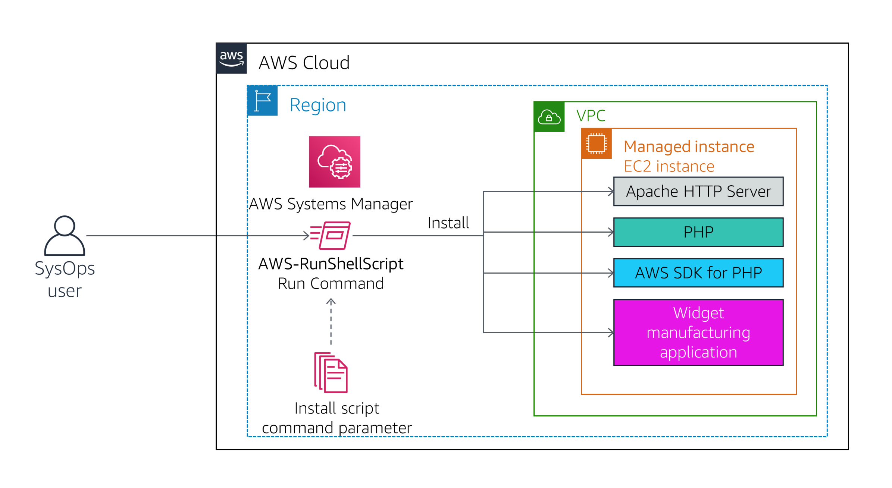
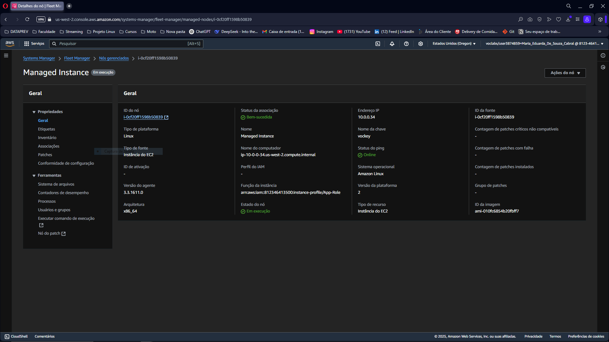
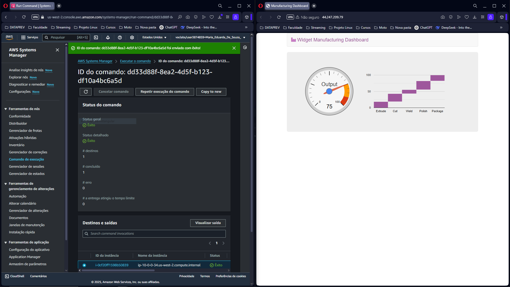
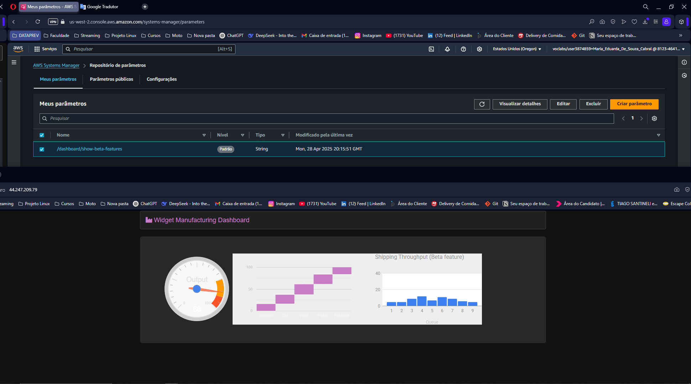
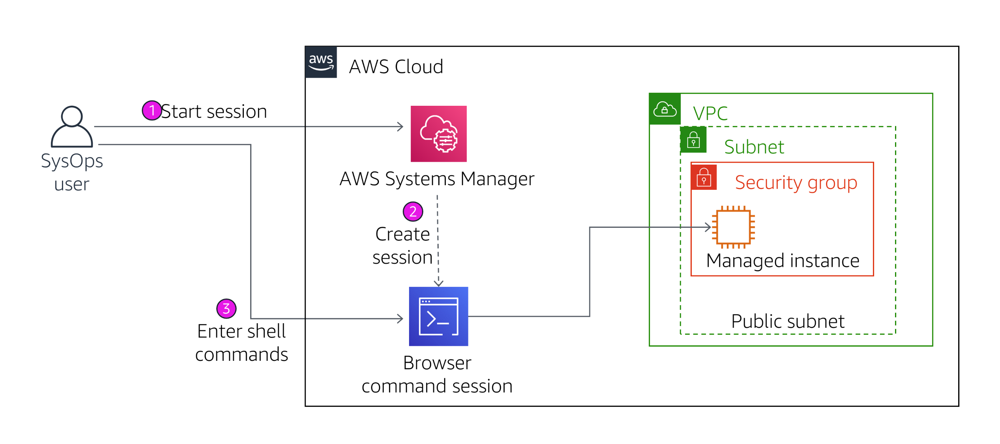
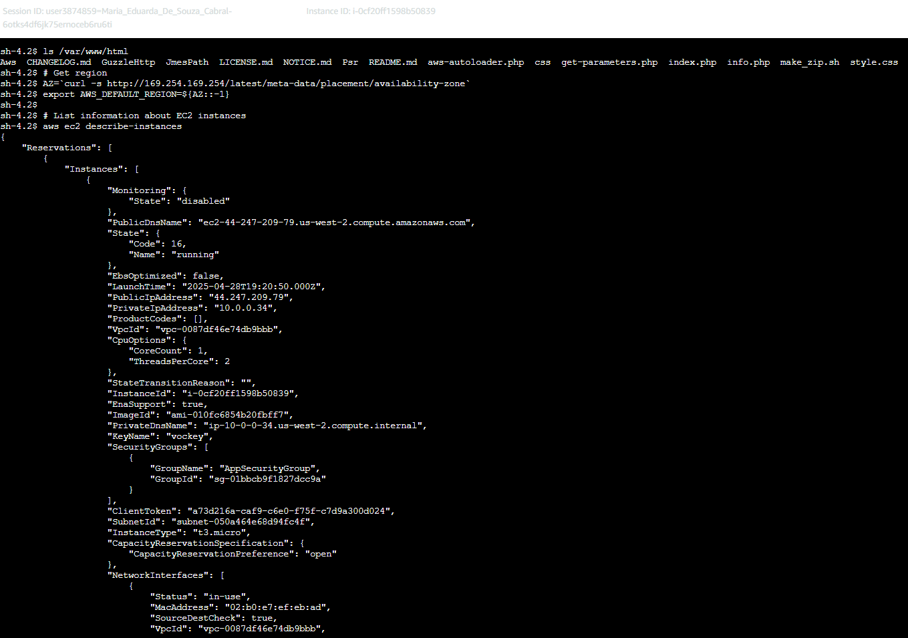

# AWS Systems Manager

## Visão Geral

O **AWS Systems Manager** é uma solução integrada para visualizar e controlar a infraestrutura da AWS. Ele permite gerenciar instâncias do Amazon EC2, servidores on-premises e máquinas virtuais de forma segura e escalável.



## Objetivos

- Verificar configurações e permissões de instâncias
- Executar tarefas em múltiplos servidores
- Atualizar configurações de aplicações
- Acessar a linha de comando de instâncias sem SSH

---

## Tarefa 1: Gerar listas de inventário para instâncias gerenciadas

1. No Console da AWS, busque por **Systems Manager** e selecione o serviço.
2. No painel de navegação à esquerda, clique em **Gerenciamento de nós** > **Fleet Manager**.
3. Selecione **Configurar inventário**.

### Configurações de Inventário

- **Nome da associação:** `Inventory-Association`
- **Destinos:**  
  - **Selecionar instâncias manualmente**  
  - Escolha a instância gerenciada disponível

4. Deixe o resto padrão e clique em **Configurar inventário**.
5. Um banner de sucesso aparecerá.
6. Clique no **ID do nó** da instância.
7. Vá até a aba **Inventário** para ver as aplicações e configurações coletadas.



---

## Tarefa 2: Instalar uma aplicação personalizada usando Executar comando

1. No Systems Manager, vá em **Gerenciamento de nós** > **Executar comando**.
2. Clique em **Executar comando**.

### Seleção do Documento

- Busque e selecione o documento de instalação da aplicação.
- Não preencha o campo de proprietário — apenas selecione o documento.

### Configurações

- **Versão do documento:** Padrão (1)
- **Destino:** Selecione instâncias manualmente
- **Opções de saída:** Desmarque a opção de bucket S3
- **Comando CLI:** (Opcional) Copie pra usar depois

3. Clique em **Executar**.

### Verificação da Aplicação

- Após status **Êxito**, copie o **ServerIP** do laboratório.
- Abra uma nova guia no navegador, cole o IP e pressione Enter.
- O **Widget Manufacturing Dashboard** deve aparecer.



---

## Tarefa 3: Usar o Armazenamento de Parâmetros para gerenciar configurações da aplicação

1. No Systems Manager, vá em **Gerenciamento de aplicações** > **Armazenamento de parâmetros**.
2. Clique em **Criar parâmetro**.

### Configurações do Parâmetro

- **Nome:** `/dashboard/show-beta-features`
- **Descrição:** `Display beta features`
- **Nível:** Padrão
- **Tipo:** Padrão
- **Valor:** `True`

3. Clique em **Criar parâmetro**.

### Verificação

- Atualize a página da aplicação no navegador.
- Se tudo der certo, 3 gráficos novos vão aparecer no Dashboard.



---

## Tarefa 4: Usar o Session Manager para acessar instâncias


*Figura 04: Systems Manager usando o Session Manager pra acessar EC2 sem SSH.*

1. No Systems Manager, vá em **Gerenciamento de nós** > **Session Manager**.
2. Clique em **Iniciar sessão**.
3. Selecione a instância e clique em **Iniciar sessão**.

### Dentro da Sessão

Rode o comando:
```sh
ls /var/www/html
```
A saída lista os arquivos da aplicação que foram instalados na instância.
Execute o seguinte comando na janela da sessão:
```sh
# Get region
AZ=`curl -s http://169.254.169.254/latest/meta-data/placement/availability-zone`
export AWS_DEFAULT_REGION=${AZ::-1}
# List information about EC2 instances
aws ec2 describe-instances
```

*Figura 05: A saída lista os detalhes da instância do EC2 correspondentes à Instância gerenciada em formato JSON.*
